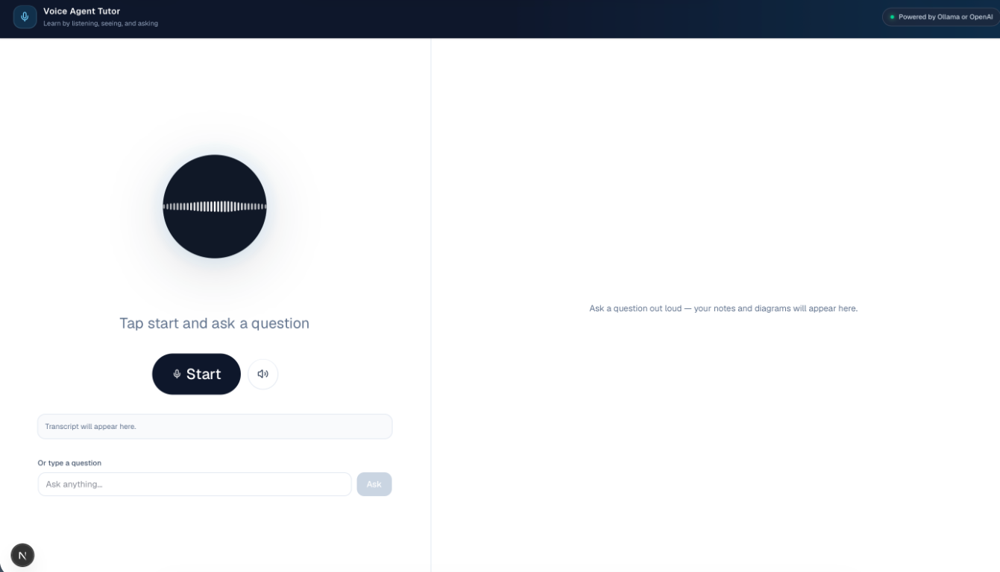
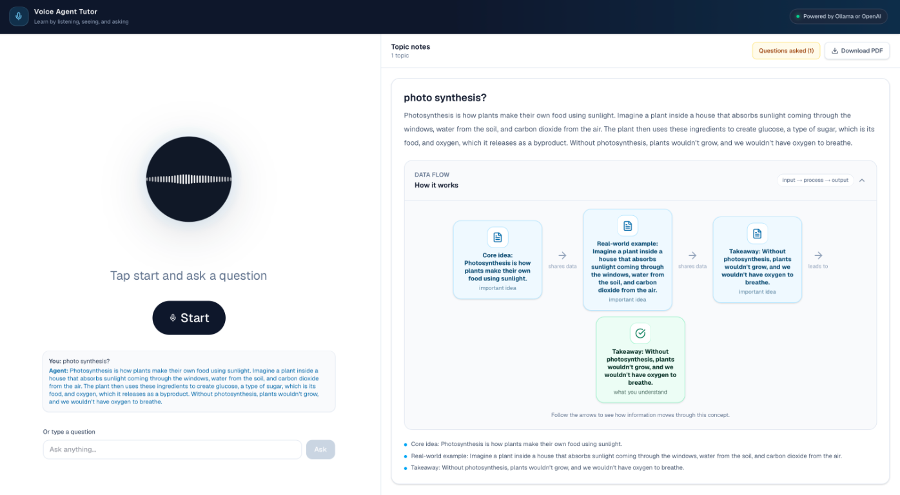

# Voice Agent Tutor

Voice Agent Tutor is a voice-first learning assistant built with Next.js. Ask a question by speaking or typing, receive an AI-generated explanation, hear the response through the browser, and follow the explanation visually through a responsive data-flow diagram.



## Preview



The interface is split into two working areas:

- **Voice workspace:** start and stop listening, mute or unmute spoken responses, review the transcript, and type a question.
- **Learning workspace:** read the explanation, expand the data-flow diagram, review key points, download notes as a PDF, and open the questions list in a popup.

## Features

- Voice input using the browser Web Speech API.
- Browser text-to-speech output with a mute/unmute control.
- Text questions as an alternative to voice input.
- Ollama support for local, private AI responses.
- Optional OpenAI support.
- Structured AI responses containing speech, topic notes, formulas, and diagrams.
- Responsive input → process → output data-flow diagrams.
- Collapsible diagrams that wrap to fit the available width without horizontal scrolling.
- Questions-asked popup for reviewing the current session.
- PDF export for generated learning notes.
- Math rendering with KaTeX.

## How the application works

1. Click **Start** and ask a question. The browser converts speech to text.
2. The client sends the conversation to `/api/chat`.
3. The API route selects Ollama or OpenAI based on `AI_PROVIDER`.
4. The model returns a validated structured response:
   - `speech` is a short explanation designed to be spoken.
   - `topics` contains descriptions, formulas, key points, and diagram data.
5. The client adds the question and answer to the transcript.
6. Browser speech synthesis reads the answer aloud unless the agent is muted.
7. The learning workspace renders the topic and its data flow:
   - blue nodes represent information inputs,
   - the indigo node represents processing or transformation,
   - the green node represents the result or takeaway.

## Project structure

```text
app/
  api/chat/route.ts       AI provider selection, prompt, validation, fallback
  globals.css             Tailwind entry point and global styles
  layout.tsx              Root HTML layout and fonts
  page.tsx                Main two-panel voice tutor interface
components/
  DiagramPanel.tsx        Notes, data-flow diagrams, questions popup, PDF export
  IconRenderer.tsx        Safe Lucide icon lookup for model-generated diagrams
  TranscriptLog.tsx       Conversation transcript
  VoiceOrb.tsx            Listening and speaking visualizer
lib/
  conversation.ts         Speech recognition, speech synthesis, chat state
  diagramSchema.ts        Zod schemas, types, and tutor system prompt
  audio/level.ts           Audio-level helpers used by the voice visualizer
public/
  voice-agent-tutor.png   README preview screenshot
.env.example              Environment variable template
```

## Setup

Install dependencies:

```bash
npm install
```

Create a local environment file:

```bash
cp .env.example .env.local
```

Start the development server:

```bash
npm run dev
```

Open [http://localhost:3000](http://localhost:3000).

## Configuration

The default configuration uses a local Ollama server:

```env
AI_PROVIDER=ollama
OLLAMA_BASE_URL=http://localhost:11434
OLLAMA_MODEL=phi3:latest
OPENAI_API_KEY=
OPENAI_MODEL=gpt-4o-mini
TTS_PROVIDER=browser
```

To use OpenAI instead, set `AI_PROVIDER=openai` and provide `OPENAI_API_KEY`. The browser speech APIs handle text-to-speech in the current implementation, so no speech API key is required for voice output.

| Variable | Purpose |
| --- | --- |
| `AI_PROVIDER` | `ollama` or `openai` |
| `OLLAMA_BASE_URL` | Local Ollama server URL |
| `OLLAMA_MODEL` | Installed Ollama model name |
| `OPENAI_API_KEY` | OpenAI secret key |
| `OPENAI_MODEL` | OpenAI model name |
| `TTS_PROVIDER` | Current voice output mode, normally `browser` |

## Voice controls

- **Start:** begins one-turn browser speech recognition and continues the conversation loop.
- **Stop:** stops listening and cancels current browser speech.
- **Mute:** cancels active spoken output and prevents future answers from being spoken until unmuted. Text responses and diagrams still continue to work.

Voice recognition and synthesis require a browser with Web Speech API support. Chrome and Safari generally provide the best support.

## Scripts

```bash
npm run dev    # Start the development server
npm run build  # Create a production build
npm run start  # Start the production server
npm run lint   # Run ESLint
```

## Production

Build and start the application with:

```bash
npm run build
npm run start
```

Keep `.env.local` private. Only `.env.example` should contain blank example values.
